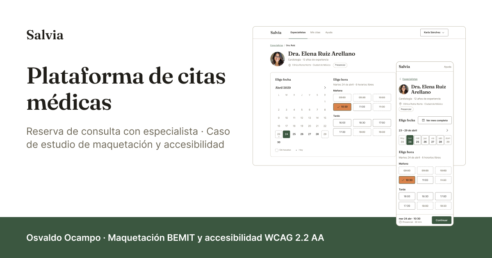

# Salvia · Plataforma de citas médicas

Caso de estudio de maquetación y accesibilidad: una plataforma para agendar citas con
especialistas médicos, construida desde un diseño cerrado en Figma. El producto es la excusa;
lo que se demuestra es el sistema de tokens, los componentes con sus estados, la accesibilidad
implementada y el comportamiento responsive.

**Demo:** [salvia-citas.netlify.app](https://salvia-citas.netlify.app) · catálogo de componentes
en [`/kit`](https://salvia-citas.netlify.app/kit)

**Diseño:** [archivo de Figma](https://www.figma.com/design/sVVjX11h3CrCOFNybb7gL1/Salvia-%C2%B7-Plataforma-de-citas-m%C3%A9dicas) con las páginas Foundations, Components, Wireframes, Desktop y Mobile



---

## Qué demuestra

- **Sistema de tokens en 3 niveles.** Primitivos (20 de color, solo los que algún rol consume),
  roles (25 de color y 8 pasos tipográficos, lo único que leen componentes y vistas) y propiedades
  de componente bajo demanda (5 públicas, como `--avatar-size`). Un solo modo, sin dark mode, como
  el archivo de Figma. Mapa token a token en [docs/tokens-equivalencias.md](docs/tokens-equivalencias.md).
- **Arquitectura BEMIT (BEM + ITCSS).** Estilos globales en SCSS por capas, de `01-settings` a
  `07-utilities`, sin CSS Modules; Stylelint vigila el patrón de clases, la especificidad máxima
  (0,2,0) y que fuera de settings no haya primitivos, hex ni colores con nombre.
- **Componentes con estados.** Los 34 componentes del kit de Figma, cada uno con su archivo en
  `src/components/` (48 componentes React en total: los 34 y 14 piezas de apoyo y patrones de
  pantalla). Sin variante Disabled: lo no disponible usa `aria-disabled` y conserva el foco.
- **Accesibilidad implementada.** Objetivo WCAG 2.2 AA: un único anillo de foco, foco gestionado
  al navegar, al validar y al cerrar diálogos, regiones de estado, `forced-colors`, texto ampliado
  y React Aria Components donde el patrón es complejo (calendario, lista de horas).
- **Responsive con container queries.** Mobile first con un solo breakpoint de página (`lg`,
  64rem); los componentes cambian de forma según el ancho de su contenedor, con umbrales derivados
  y documentados en [DESIGN.md](DESIGN.md) § Contenedores.

---

## Stack tecnológico

**Estructura**


**Estilos**


**Accesibilidad**


**Build y herramientas**


**Diseño**


**Despliegue**


**Control de versiones**


---

## Accesibilidad

El objetivo es **WCAG 2.2 AA**. Este README no afirma conformidad: dice qué se midió, con qué
herramientas y qué queda abierto. La matriz completa, criterio a criterio, está en
[docs/auditoria.md](docs/auditoria.md); el guion manual, con lo que dijo el lector de pantalla
en cada paso, en [docs/auditoria-manual.md](docs/auditoria-manual.md).

**Automático (7.3).** `pnpm verify 7.3` audita el build, nunca el servidor de desarrollo, con Edge
headless por CDP:

- axe-core 4.13.0 (reglas de WCAG 2.0, 2.1 y 2.2 A y AA) en 85 pasadas sobre las 16 cargas
  completas y los estados con interacción (hojas, diálogo, menú, errores, avisos, vacíos…), a 375
  y 1440.
- Contraste renderizado: 34 pares con el fondo efectivo, ninguno de los 6 pares «No usar» del
  diseño; y el anillo de foco de cada parada de Tab (929 paradas) contra los píxeles que lo rodean.
- Foco no tapado (2.4.11) en 1770 paradas, tamaño del objetivo (2.5.8) en 2752 objetivos,
  espaciado del texto (1.4.12) en 61 estados y ayuda coherente (3.2.6).
- Cada regla tiene su contraprueba: una mutación que debe hacerla fallar, para demostrar que la
  medida discrimina.

**Manual (7.4).** NVDA 2026.2 con Firefox 157 y, para repetir los hallazgos, con Chrome 154;
teclado en Firefox 157; Chrome 153 en un Android; y la importación del `.ics` en Google Calendar.

**Tandas de 7.6.** Tras el despliegue de las correcciones, dos tandas más con NVDA contra
producción: con Firefox las dos y con Chrome solo la primera. Las versiones de NVDA, Firefox y
Chrome no se anotaron.

**Corregido en 7.6:**

- **Confirmado de oído en Firefox y en Chrome:** el anuncio del mes dentro de la hoja del
  calendario, que no se oía, y los campos obligatorios, que se anunciaban como «entrada inválida»
  antes del primer envío.
- **Confirmado de oído en Firefox:** el nombre del disparador de filtros, que se anunciaba con el
  recuento anterior al aplicar, y las celdas del calendario, que arrastraban el estado del mes
  anterior.
- **Medido solo en Chromium (Edge headless), sin medir en Firefox:** Inicio y Fin en la lista de
  horas, que dejaban la hora enfocada fuera de la vista, y el anillo de foco, que quedaba en parte
  bajo la barra fija.
- **Medido en Chromium:** en el catálogo `/kit`, el anillo de dos controles no contrastaba con lo
  que lo rodeaba (la barra de actual de un Nav Item y el texto bajo el salto al contenido).

**Resultado al cierre de 7.6, contra producción:** `pnpm verify 7.3` 32/33, con un ✗ declarado.

**Queda abierto:**

- **Resto de pintado en `/kit`** (✗ declarado): tras navegar en cliente con el catálogo
  desplazado, a 1350 de ancho quedan píxeles de los avatares bajo la última barra (12632 px con
  delta 230). Las vistas de la app dan 0.
- **El recuento al aplicar filtros** (fila declarada): tras «Ver 11 resultados», NVDA con Firefox
  anuncia el disparador con su nombre nuevo, pero no «11 resultados», aunque en el arnés la región
  cambia con el diálogo ya cerrado; causa sin aislar. No es un ✗ de WCAG: el recuento se oye en la
  hoja al cambiar el filtro y va en el nombre del botón que aplica.
- **Sin medir**, recortado de la prueba manual: `hyphens` y texto grande en Chrome y Android, el
  `.ics` en Outlook y en Firefox, parte del calendario con lector, Atrás con la hoja del
  calendario abierta y el foco devuelto por las hojas en Firefox.
- **Sin dispositivo:** Safari de macOS e iOS, VoiceOver y la zona segura de un iPhone.

---

## Verificación

`pnpm verify <sección>` ([docs/verificacion.md](docs/verificacion.md)) mide cada sección contra
las cifras de su informe y escribe una línea ✓/✗ por comprobación. Un ✗ es una regresión o un
cambio que hay que explicar, nunca un número que se ajusta sin más.

- **Secciones:** 4.1–4.7 (los componentes del kit), 5.0–5.4 (las vistas), 7.0 (el despliegue en
  Netlify) y 7.3 (la auditoría automática).
- **Pares contra Figma:** las pantallas se comparan con sus frames de Figma, posición y tamaño de
  cada pieza a ±1 px, a 375 y 1440; las diferencias que no son de construcción (el ancho de un
  texto por la métrica de la fuente) se declaran con su cifra.
- **Contrapruebas:** cada regla se rompe a propósito con un estilo o una mutación temporal y la
  medida tiene que cambiar; `check-data --contrapruebas` rompe una a una las aserciones de los
  datos simulados.
- **Teclado y ratón reales** por CDP, con las dos barras de scroll (superpuesta y la clásica de
  Windows), `forced-colors`, texto al 200 % y la letra del navegador a 24 y 32.
- **Flujos de foco contra el build y contra producción:** con `--preview` y `VERIFY_BASE`, los
  flujos que dependen del orden de los efectos se miden sin el `StrictMode` del desarrollo.
- **Despliegue (7.0):** estado HTTP de cada ruta (404 real fuera de las rutas de la app), caché,
  iconos, imagen OG y nada de terceros en la página.

---

## Inicio rápido

Requisitos: Node ≥ 22.18 y pnpm ≥ 11 (la versión exacta sale de `packageManager`, con Corepack).
`pnpm verify` necesita además Microsoft Edge; fuera de Windows, `EDGE_PATH=/ruta/a/edge`.

```bash
git clone https://github.com/Osvalam86/salvia-citas.git
cd salvia-citas
pnpm install
pnpm dev
```

Abre [http://localhost:5173](http://localhost:5173). Los datos son simulados: el año es 2029, hoy
es el lunes 23 de abril y la sesión es la de Karla Sánchez. Todo se reinicia al recargar.

| Script | Qué hace |
|---|---|
| `pnpm dev` | Servidor de desarrollo de Vite en `localhost:5173` |
| `pnpm build` | Comprueba los tipos (`tsc -b`) y genera `dist/` |
| `pnpm lint` | ESLint (con `jsx-a11y` en modo strict), Stylelint, el espejo del breakpoint entre SCSS y TS y las aserciones de los datos simulados |
| `pnpm contrast` | Reproduce los 31 pares de contraste de Figma desde el SCSS compilado |
| `pnpm verify <sección>` | Verifica una sección contra su informe (con `pnpm dev` en marcha; `--preview` contra el build, `VERIFY_BASE` contra otro servidor) |
| `pnpm preview` | Sirve `dist/` en `localhost:4173` |

---

## Estructura del proyecto

```text
salvia-citas/
├── src/
│   ├── styles/                # ITCSS, de menor a mayor especificidad (main.scss importa las capas)
│   │   ├── 01-settings/       # tokens, breakpoints y contenedores; el único que emite :root
│   │   ├── 02-tools/          # mixins y funciones: texto, breakpoint, container query, foco
│   │   ├── 03-generic/        # reset
│   │   ├── 04-elements/       # base, anillo de foco global y enlaces subrayados
│   │   ├── 05-objects/        # o-wrapper, o-layout, o-stack, o-cluster
│   │   ├── 06-components/     # un parcial c-* por bloque BEM
│   │   └── 07-utilities/      # u-sr-only
│   ├── components/            # 48 componentes React: los 34 del kit y 14 de apoyo
│   ├── views/                 # las vistas, la página genérica, el 404 y el catálogo /kit
│   ├── data/                  # datos simulados y tipados, reloj fijo, sin backend
│   ├── hooks/                 # foco de ruta, media query, título de página…
│   └── assets/                # los 19 iconos Phosphor y las fotos de avatar
├── scripts/
│   ├── verify/                # arnés de pnpm verify: Edge headless por CDP, sin dependencias
│   ├── check-data.mjs         # aserciones de los datos simulados (en pnpm lint)
│   ├── check-breakpoints.mjs  # el breakpoint de SCSS y el de TS no pueden divergir
│   └── contrast.mjs           # pnpm contrast
├── docs/                      # diseño implementable, auditorías, verificación y tokens
├── public/                    # favicon, imagen OG y _redirects de Netlify
├── .claude/skills/            # skills del proyecto (bemit-scss, semantic-markup, theme-tokens…)
├── DESIGN.md                  # contrato de la capa de estilos y decisiones D1–D18
└── netlify.toml               # build con lint y contraste, caché de /assets
```

---

## Documentación

- [DESIGN.md](DESIGN.md): contrato de la capa de estilos. Decisiones de traducción de tokens,
  breakpoint y contenedores con su derivación, constantes sin variable en Figma, decisiones de
  arquitectura (D1–D18) y pendientes anotados.
- [docs/diseno-implementable.md](docs/diseno-implementable.md): lo que el diseño decide y el código
  respeta. Reglas transversales, los 34 componentes, las 4 vistas y los datos.
- [docs/auditoria.md](docs/auditoria.md): auditoría automática, matriz WCAG 2.2 A y AA, hallazgos y
  limitaciones.
- [docs/auditoria-manual.md](docs/auditoria-manual.md): guion de la prueba manual con lo que se oyó
  en cada paso.
- [La guía definitiva para dejar de adivinar cómo nombrar tus clases CSS](https://medium.com/@osvaocampo/la-gu%C3%ADa-definitiva-para-dejar-de-adivinar-c%C3%B3mo-nombrar-tus-clases-css-859fcc314095):
  el artículo de Medium sobre BEMIT en el que se apoya la arquitectura de estilos.

---

## Autor y licencia

**Osvaldo Ocampo** · [LinkedIn](https://www.linkedin.com/in/osvaldo-ocampo/) ·
[GitHub](https://github.com/Osvalam86)

- **Código:** MIT ([LICENSE](LICENSE)). `src/`, `scripts/`, `index.html` y la configuración de la
  raíz.
- **Documentación y skills:** CC BY 4.0 ([LICENSE-DOCS](LICENSE-DOCS)). Todos los `.md` del
  repositorio y `.claude/skills/`.
- **Fuera de las dos licencias:** las fotografías de avatar de `src/assets/avatars/`, rostros
  generados con IA, y el material de terceros (dependencias, tipografías Fraunces e Inter, iconos
  Phosphor), que conserva la licencia de su autor. Detalle en [LICENSE-DOCS](LICENSE-DOCS).
